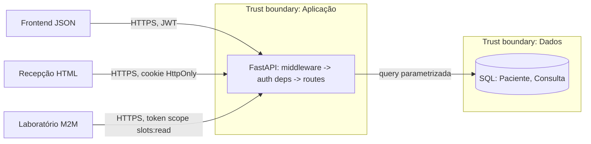

# Relatório Técnico — API de Agendamento de Consultas (DR2 AT)

Stack: FastAPI + APIRouter, Pydantic v2, SQLModel, PyJWT, bcrypt, Jinja2, pytest.
Estrutura: `app/{routes,models,database,auth}`; segurança centralizada em `app/auth/deps.py`.

## Ex.1 — Fundação
- venv isolado (`python -m venv .venv`), `requirements.txt` com versões fixas.
- Módulos: `routes/` (um APIRouter por recurso), `models/` (tabelas + schemas), `database.py`.
- Teste: `tests/test_consultas.py::test_criar_consulta_sucesso`.

## Ex.2 — Exposição de dados e XSS
- `ConsultaPublic` / `PacientePublic`: whitelist de saída. `observacoes_internas`, `criado_por`, `cpf` nunca saem.
- Página `/agenda` (Jinja2, `agenda.html` herda `base.html`), autoescape ligado, zero `|safe`.
- CSP `default-src 'none'` bloqueia script inline mesmo se o escape falhar.

## Ex.3 — CIA, frameworks e DFD

| Pilar | Risco em dado de saúde | Controle implementado |
|---|---|---|
| Confidencialidade | Vazamento de prontuário/CPF | response models, ownership, JWT, `Cache-Control: no-store`, CSP |
| Integridade | Alterar consulta/papel | `extra='forbid'`, RBAC, regex whitelist, queries parametrizadas |
| Disponibilidade | Brute force / abuso | rate limit no login e no `/oauth/token`, paginação com teto |

| Framework | Item | Controle concreto |
|---|---|---|
| OWASP API Top 10 | API1 BOLA | `consulta_or_404`, `paciente_acessivel` |
| OWASP API Top 10 | API3 Property Level | response models + `extra='forbid'` |
| OWASP API Top 10 | API2 Broken Auth | bcrypt, JWT exp/aud/iss, MFA admin |
| OWASP API Top 10 | API8 Misconfig | CORS allowlist, headers, docs off em prod |
| NIST SSDF | PW.5 / PW.7 / PW.8 | código seguro, revisão, testes (pytest, bandit, ZAP) |
| NIST SSDF | PS.1 | segredos fora do código (`.env`) |
| MITRE ATT&CK | T1110 Brute Force | rate limit + hash com custo |
| MITRE ATT&CK | T1078 Valid Accounts | MFA + expiração 15 min |
| MITRE ATT&CK | T1190 Exploit Public-Facing App | validação de entrada, SAST/DAST |

Fluxos sensíveis: paciente (nome, CPF, e-mail, telefone) FE/Recepção <-> API <-> DB. O laboratório só recebe horários livres, nunca dado de paciente.

## Ex.4 — Threat model (STRIDE)

Ativos: dados de paciente (CPF, motivo da consulta), credenciais/JWT, agenda, segredos (`SECRET_KEY`, DB, client do lab).
Superfícies: `/auth/login`, `/oauth/token`, `/consultas*`, `/pacientes*`, `/lab/*`, `/agenda`, OpenAPI.

Misuse cases: (M1) profissional B lê consulta de A trocando o ID; (M2) atacante força senha no login; (M3) recepcionista injeta `<script>` no motivo; (M4) token do lab usado para ler consultas; (M5) cliente envia `papel`/`status` extra; (M6) SQLi no filtro de pacientes.

| Componente | S | T | R | I | D | E |
|---|---|---|---|---|---|---|
| Auth (`/auth/login`) | senha vazada -> MFA admin | — | log de login | mensagem genérica | rate limit | RBAC no DB |
| Consultas | JWT forjado -> `alg` fixo | `extra='forbid'` | `criado_por` | ownership + response model | paginação | dependência de role |
| Lab M2M | secret roubado -> escopo mínimo | — | `sub`=client_id | só slots livres | rate limit | `typ=m2m` não vira usuário |
| Página `/agenda` | cookie HttpOnly/Strict | autoescape | — | CSP, sem CPF | — | papéis permitidos |

Mitigação -> teste: M1 `test_bola_*`; M2 `test_rate_limit_login`; M3 `test_xss_*`; M4 `test_lab_m2m_*`; M5 `test_mass_assignment_*`; M6 `test_sqli_*`.

## Ex.5 — Partições e vetores

Partições: (1) borda: CORS, headers, rate limit; (2) identidade: login, JWT, OAuth M2M; (3) autorização: RBAC + ownership; (4) domínio: routes/models; (5) dados: SQLModel/DB; (6) CI/CD.

| Eixo | Vetor | Mitigação |
|---|---|---|
| Design | BOLA, mass assignment, sobre-exposição, escopo amplo do lab | ownership, `extra='forbid'`, response models, `slots:read` |
| Implementação | SQLi, XSS armazenado, JWT `alg=none`, timing de login | parametrização, whitelist+autoescape, `algorithms=[HS256]`, hash dummy |
| Infraestrutura | CORS `*`, sem HSTS, docs expostas, segredo no repo, brute force | allowlist, headers, docs off em prod, `.env`, rate limit |

## Ex.6 — Autenticação e autorização
- OAuth2PasswordBearer + bcrypt (custo 12); senha nunca em texto plano; mín. 12 chars, máx. 72 bytes.
- JWT: `exp` 15 min, `iss`, `aud`, `jti`, `typ`, `amr`. Admin só entra com MFA simulado (`otp` no `amr`).
- **Modelo escolhido: RBAC + verificação de ownership por recurso.** Só 3 papéis fixos, então RBAC resolve; ABAC seria complexidade desnecessária. O ownership cobre o "só os próprios pacientes/consultas".
- Teste: `test_nao_admin_bloqueado_em_rota_de_admin`.

## Ex.7 — M2M
- **Client Credentials** (`POST /oauth/token`): sem usuário, é máquina-a-máquina.
- Token do lab: `typ=m2m`, `scope=slots:read`, 10 min. Token de usuário: `typ=user`, `amr`.
- Mesmo com token vazado: `get_current_user` recusa `typ=m2m`; `require_scope` recusa token de usuário. Só lê horários livres.

## Ex.8 — Vulnerabilidades identificadas (código inicial em `docs/evidencias/ex08_codigo_vulneravel.py`)

| # | Falha | OWASP | Endpoint |
|---|---|---|---|
| 1 | BOLA: ID na URL sem checar dono | API1 / A01 | `GET /consultas/{id}` |
| 2 | SQL concatenado | A03 Injection | `GET /pacientes?q=` |
| 3 | XSS armazenado (`\|safe`) | A03 / A07 XSS | `/agenda` (motivo) |
| 4 | Mass assignment | API3 | `PATCH /consultas/{id}` |
| 5 | Credencial hardcoded | A05 Misconfig | `database` |

## Ex.9 — Correções e evidência antes/depois

| Ataque | Antes | Depois | Teste |
|---|---|---|---|
| `GET /consultas/1` com token do prof. B | 200 + dados | 404 | `test_bola_*` |
| `q=' OR '1'='1` | todos os pacientes | 422 | `test_sqli_*` |
| motivo `<script>` | salvo e executado | 422; se já no banco, `&lt;script&gt;` | `test_xss_*` |
| `{"papel":"admin"}` / `status` extra | aplicado | 422 | `test_mass_assignment_*` |

**Endpoint extra com o mesmo padrão:** `PATCH` e `DELETE /consultas/{id}` e `GET /pacientes/{id}` (não citados no Ex.8) passam pelo mesmo ownership central (`consulta_escrita`, `paciente_acessivel`).

## Ex.10 — Hardening
CORS com `CORS_ORIGINS` (sem `*`), HSTS, `X-Frame-Options: DENY`, `X-Content-Type-Options: nosniff`, CSP, `Referrer-Policy`. Rate limit: login 5/min por IP, `/oauth/token` 20/min (429 + `Retry-After`).

## Ex.11 — Persistência
SQLModel, `select().where()` sempre parametrizado, `Session` via `Depends(get_session)`, `BaseSettings` + `.env` (só `.env.example` no ZIP). Trocar `DATABASE_URL` para PostgreSQL não muda código.

## Ex.12 — Pipeline DevSecOps

| Fase SDLC | Ferramenta | Por quê |
|---|---|---|
| Commit / PR | SAST (bandit) | rápido, acha SQLi/segredo/cripto fraca no código |
| Commit / PR | SCA (pip-audit) | CVE em dependência aparece a qualquer hora |
| Build / teste | pytest de segurança | vem direto do threat model (M1–M6) |
| Ambiente de teste | DAST passivo (ZAP baseline) | precisa da app rodando; passivo é seguro no CI |
| Staging (fora do CI) | IAST + DAST ativo | IAST exige agente na app em execução com tráfego de teste; ativo é lento e invasivo |

**Critério do gate: bloqueia CVSS >= 7.0 (High/Critical).** Motivo: dado de saúde (LGPD) torna High inaceitável; Medium/Low geram relatório e backlog para não travar o time. Dependência com CVE conhecida bloqueia sempre.

| Vulnerabilidade | Vetor CVSS 3.1 | Score* | Impacto de negócio |
|---|---|---|---|
| SQL Injection | AV:N/AC:L/PR:N/UI:N/S:U/C:H/I:H/A:H | 9.8 | vazamento total, multa LGPD |
| Mass assignment / escalada | AV:N/AC:L/PR:L/UI:N/S:U/C:H/I:H/A:N | 8.1 | usuário vira admin |
| Brute force no login | AV:N/AC:H/PR:N/UI:N/S:U/C:H/I:H/A:N | 7.4 | conta comprometida |
| BOLA | AV:N/AC:L/PR:L/UI:N/S:U/C:H/I:N/A:N | 6.5 | prontuário de terceiro exposto |
| XSS armazenado | AV:N/AC:L/PR:L/UI:R/S:C/C:L/I:L/A:N | 5.4 | roubo de sessão da recepção |
| CORS/headers fracos | AV:N/AC:H/PR:N/UI:R/S:U/C:L/I:L/A:N | 4.2 | ataque via navegador |

*Conferir na calculadora oficial do FIRST antes de entregar. Nota: BOLA dá 6.5 pela fórmula, mas o negócio o trata como bloqueante por ser dado de saúde; o gate automático não pega esse caso, por isso ele fica coberto por teste (`test_bola_*`).

Arquivo do pipeline: `.github/workflows/security.yml`. Testes de autorização expandidos em `tests/test_security.py` e `tests/test_auth.py`.

## Ex.13 — Capstone

**Scan ZAP (passivo):** `docker run --rm --network host -v "$PWD":/zap/wrk/:rw ghcr.io/zaproxy/zaproxy:stable zap-baseline.py -t http://localhost:8000 -J zap.json -r zap.html -I`
Resultado: **(preencher com a saída real do scan; anexar zap.html)**

| Finding (ZAP / auditoria) | OWASP | Correção no código | Prova |
|---|---|---|---|
| Missing Anti-clickjacking / X-Content-Type | API8 | `middleware.py` | `test_headers_de_seguranca` |
| CORS misconfiguration | API8 | allowlist em `main.py` | `test_cors_allowlist` |
| Sobre-exposição de campos | API3 | response models | `test_auditoria_openapi` |
| BOLA | API1 | `auth/deps.py` | `test_bola_*` |
| Injeção / XSS | A03 | regex + parametrização + autoescape | `test_sqli_*`, `test_xss_*` |
| Brute force | API2 | `ratelimit.py` | `test_rate_limit_login` |
| Auditoria OpenAPI | API9 | docs off em prod; schemas `additionalProperties: false` | `test_auditoria_openapi` |

**Risco residual**
1. Rate limit em memória: não vale com várias instâncias; IP atrás de proxy precisa de `X-Forwarded-For` confiável.
2. MFA é simulado (código fixo em env), não TOTP real.
3. JWT stateless: sem revogação antes dos 15 min (sem refresh/blacklist).
4. Sem log de auditoria de leitura de prontuário (LGPD).
5. SQLite/segredos em `.env` no ambiente atual; produção precisa de secret manager e TLS no proxy.

**Decisão: o risco residual NÃO bloqueia um piloto interno, mas o item 2 (MFA simulado) BLOQUEIA o deploy em produção real.** Motivo: contas admin com código fixo anulam o controle mais forte sobre o dado mais sensível. Itens 1, 3 e 4 entram como condição com prazo (30 dias) após o go-live.
